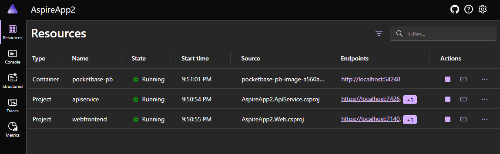
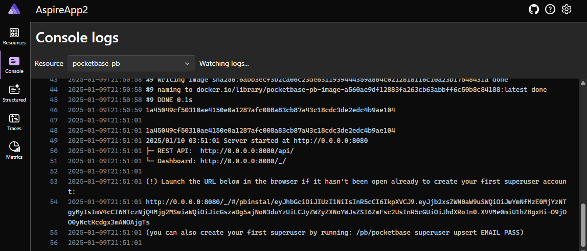

# 🚀 Pocketspire - a Pocketbase Docker Container for .NET Aspire 🌟

This package makes it easy to build and run a [Pocketbase](https://github.com/pocketbase/pocketbase) Docker Linux container within your [.NET Aspire](https://docs.microsoft.com/en-us/aspnet/core/dotnet-aspire?view=aspnetcore-9.0) projects.

## 🎉 Getting Started

This uses a slightly more configurable Dockerfile mentioned in the Pocketbase docs: https://pocketbase.io/docs/going-to-production/#using-docker

### ✅ Prerequisites
- .NET 9 SDK or later installed on your machine.

### 📦 Installation

Pocketspire on nuget.org

Add the nuget package and then the extension method to your `AppHost`:

```csharp
using Pocketspire;

var builder = DistributedApplication.CreateBuilder(args);

var pocketbase = builder.AddPocketbaseContainer("pb");

// ...
```

### Parameters

- **name**: The name of the instance. This appends to the name like: "pocketbase-{name}".
- **arm64cpu** (optional): Specifies whether to use an ARM64 CPU. Default is `false`.
- **exposedPort** (optional): The port to be exposed. Default is `null`.
- **pocketbaseVersion** (optional): The version of PocketBase to use. Default is `"0.24.1"`.

### Find your app in the dashboard!



### Grab your setup link from the console (first-time use)!
